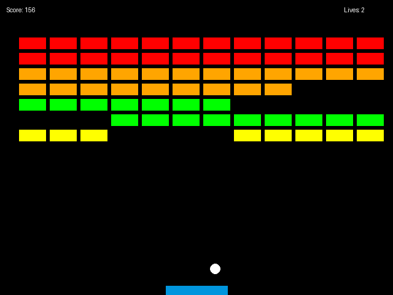
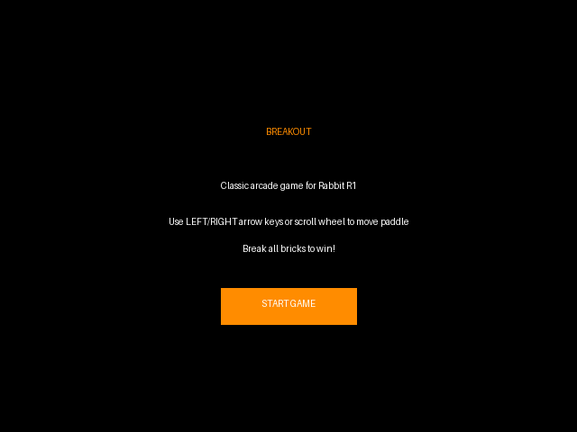

# Breakout Game for Rabbit R1

## Table of Contents
- [Project Overview](#project-overview)
- [About Breakout](#about-breakout)
- [Installation Instructions](#installation-instructions-for-rabbit-r1)
- [Controls](#controls)
- [Game Rules and Scoring](#game-rules-and-scoring)
- [Special Considerations for Rabbit R1](#special-considerations-for-rabbit-r1)
- [Troubleshooting Common Issues](#troubleshooting-common-issues)
- [Credits and Acknowledgments](#credits-and-acknowledgments)

## Project Overview

This is a modern implementation of the classic Breakout arcade game, specifically optimized for the Rabbit R1 device. The game features smooth gameplay, responsive controls adapted for the R1's scroll wheel, and performance optimizations to ensure a great gaming experience on the device's hardware.

### About Breakout

Breakout was created in 1976 by Atari, developed by Nolan Bushnell and Steve Bristow. It adapted Pong's mechanics for solo play and pioneered the "paddle & ball vs. blocks" game mechanic that became a foundational element in arcade and home video game history.

The game's core mechanics involve:
- A player-controlled paddle at the bottom of the screen
- A ball that bounces off the paddle, walls, and bricks
- Rows of bricks at the top of the screen that are destroyed when hit by the ball
- The goal is to clear all bricks without letting the ball fall below the paddle

## Installation Instructions for Rabbit R1

1. **Download the Game Files**
   - Download the game package (`breakout_r1.zip`) from the provided link
   - Extract the files to a temporary location on your computer

2. **Transfer to Rabbit R1**
   - Connect your Rabbit R1 device to your computer via USB
   - When prompted, select "File Transfer" mode on your R1
   - Copy the extracted game files to the "Games" folder on your R1
   - If the "Games" folder doesn't exist, create it first

3. **Launch the Game**
   - Disconnect your R1 from the computer
   - Navigate to the "Games" folder using the scroll wheel
   - Select the "Breakout" folder
   - Tap the "index.html" file to launch the game

4. **Alternative Installation**
   - If your R1 has internet connectivity, you can access the game directly by navigating to the hosted version at the provided URL
   - The game will automatically adapt to the R1's display and controls

## Controls

### Using the Scroll Wheel (Primary Control Method)

- **Scroll Down**: Move paddle right
- **Scroll Up**: Move paddle left
- **Scroll Speed**: Controls paddle movement speed (adaptive sensitivity)
- **Push Button**: Pause/Resume game (when available)

The game has been specifically optimized for the R1's scroll wheel with:
- Reduced sensitivity for more precise control
- Event throttling to prevent overwhelming the game
- Smooth movement with easing for natural control

### Alternative Controls

- **Touch**: Tap left or right side of screen to move paddle
- **Keyboard** (if available): Left/Right arrow keys to move paddle
- **Pause**: Tap center of screen or press P key

## Game Rules and Scoring

### Basic Rules

1. Move the paddle to bounce the ball and prevent it from falling off the bottom of the screen
2. Break all the bricks to complete a level
3. You start with 3 lives
4. Lose a life when the ball falls below the paddle
5. Game ends when all lives are lost or all levels are completed

### Scoring System

Different brick colors have varying point values:
- Yellow bricks: 1 point each
- Green bricks: 3 points each
- Orange bricks: 5 points each
- Red bricks (top level): 7 points each

Additional scoring mechanics:
- Points are earned by destroying bricks with the ball
- Breaking all bricks in a level awards bonus points
- Consecutive brick hits without touching the paddle increase point multipliers

## Special Considerations for Rabbit R1

### Hardware Considerations

- **Display**: The game is optimized for the R1's 2.88-inch LCD touchscreen (640x480px)
- **Performance**: Optimized for the MediaTek Helio G36 processor and 4GB RAM
- **Input**: Specially adapted for the R1's scroll wheel as the primary input method

### Optimizations for R1

1. **Performance Optimizations**
   - Delta time implementation for consistent gameplay regardless of frame rate
   - Optimized collision detection to reduce CPU usage
   - Object pooling to reduce memory usage
   - Frame rate limiting with fallback options
   - Reduced visual effects for better performance

2. **Input Handling Optimizations**
   - Scroll wheel debouncing for smoother control
   - Adaptive sensitivity based on scroll speed
   - Smooth paddle movement with easing
   - Multiple input method fallbacks

3. **Display Optimizations**
   - UI elements sized appropriately for the 2.88-inch screen
   - High contrast visuals for better visibility on the small display
   - Simplified graphics for optimal performance

## Troubleshooting Common Issues

### Scroll Wheel Response Issues

- **Problem**: Paddle moves inconsistently or too fast/slow
- **Solution**: Adjust sensitivity in the game settings menu or restart the game

### Performance Issues

- **Problem**: Game runs slowly or stutters
- **Solution**: 
  - Close other applications running on your R1
  - Enable "Performance Mode" in the game settings
  - Reduce visual effects in settings if available

### Game Not Loading

- **Problem**: Game fails to start or shows a blank screen
- **Solution**:
  - Ensure your R1 has the latest system updates
  - Try restarting your R1 device
  - Reinstall the game files

### Controls Not Working

- **Problem**: Paddle doesn't respond to scroll wheel
- **Solution**:
  - Try alternative controls (touch or keyboard if available)
  - Restart the game
  - Check if scroll wheel works in other applications

## Credits and Acknowledgments

- Original Breakout game created by Atari (1976)
- This implementation based on research of classic breakout games and modern web technologies
- Developed specifically for the Rabbit R1 device with optimizations for its unique hardware
- Special thanks to the open-source community for HTML5 game development resources

### References

- MDN Web Docs for Canvas API documentation
- Rabbit R1 device specifications and developer guidelines
- Classic arcade game preservation resources

---

© 2025 Breakout for Rabbit R1 | Version 1.0